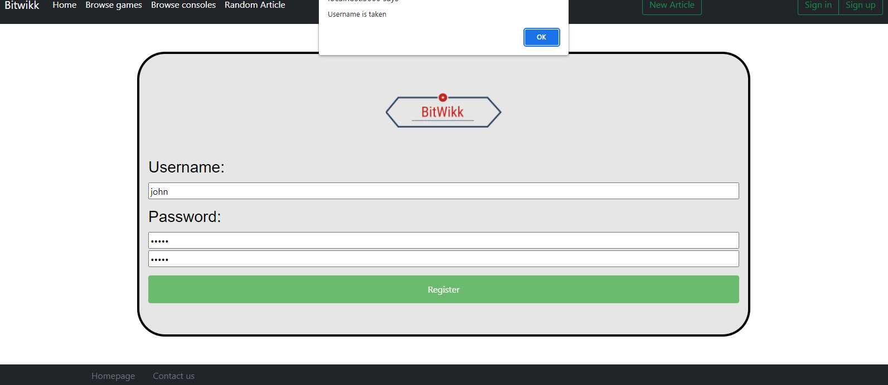
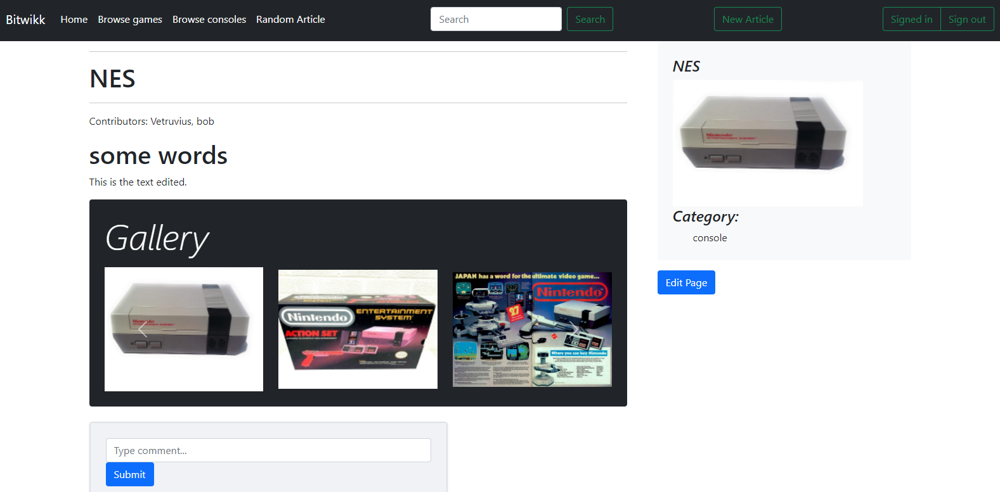
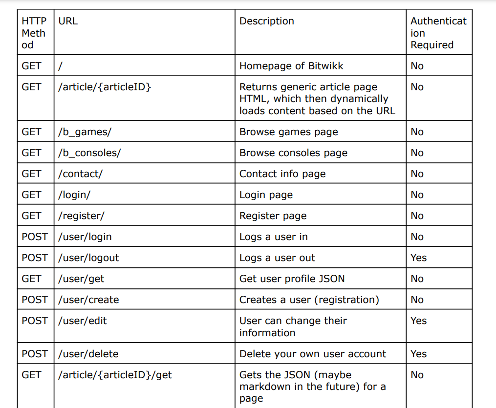
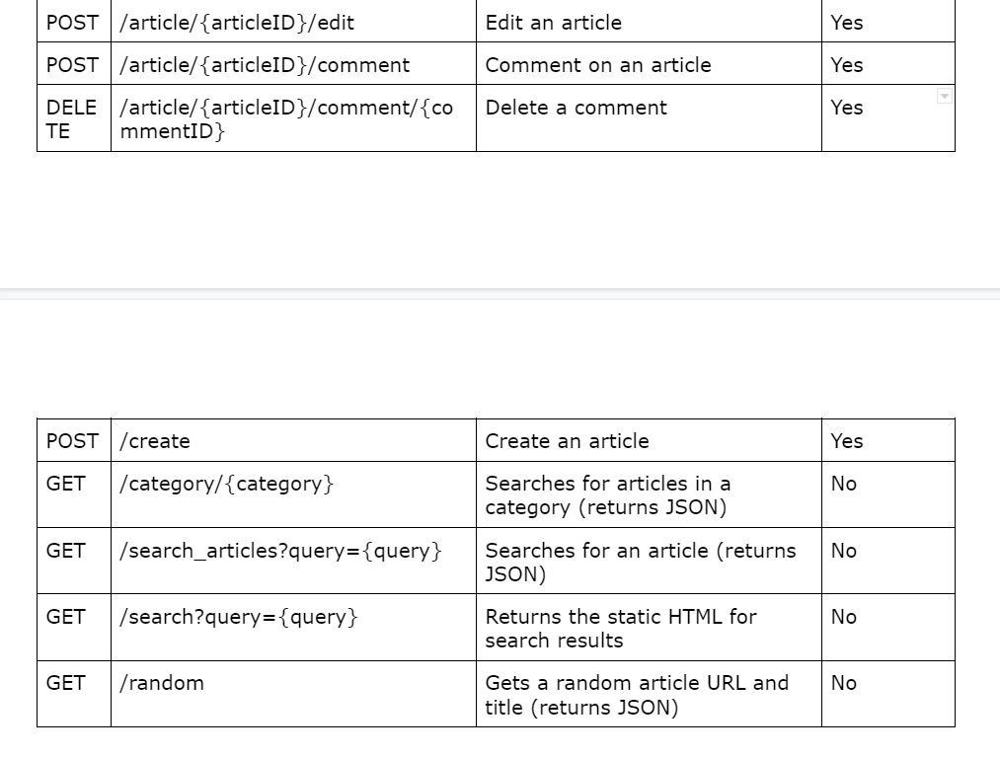

# BitWikk
Spring 2022

## Overview:
BitWikk acts as a website for people to easily access in depth information regarding retro video games, consoles, and other topics surrounding them. BitWikk is in a "wiki" format, and while wikis for specific game series or consoles often exist, there is currently no widely used wiki for in depth information covering all retro games.

## Team Members
Einar Klarlund, einarklarlund

Brian Zhang, BrianZhang42

Donald Hurld, DonaldHurldUni

Neil Gupta, nog642

## User Interface

### Register Page

 
 
Demonstrates the Create Operation by allowing a user to create an account in which the user inputs a username and password that is stored. Additionally, UI informs the user of invalid registration informaiton.

### Article Page

 
Demonstrates the Read Operation, because the client side JS gets the article content as a JSON from the server using a GET request, then renders it on the page.

### Article Edit Page

 
Demonstrates the Update Operation by allowing the user to edit an article page and update any information they see fit. 

### Sign out

 
Demonstrates the Delete Operation by allowing the user to sign out, making the server delete the session.

Above, we first see what the user sees when they are signed in: the "Signed in" message, letting them know they are signed in, and the "Sign out" button. Next, we see what the user sees after clicking the "Sign out" button: a button to "Sign in" and a button to "Sign up".

Clicking the "Sign out" button sends a POST request to the server, deleting the session, and the server response's `Set-Cookie` header deletes the cookies on the client side. The client side JS then reloads the page.

## APIs
`GET  /article/{ID}` 
This serves the static `article_page.html`, which then dynamically calls `GET /article/{ID}/get` and renders the content.

`GET  /article/{ID}/get` 
This returns a JSON with article content

`POST /create` 
Requires login (cookie header). Body: `{title: title, content: content}` 
This request will be used to create new articles.

`POST /article/{ID}/edit` 
Requires login (cookie header). Body: `{content: content}` 
This request will be used to edit articles.

`POST /article/{ID}/comment` 
Requires login (cookie header). Body: `{content: content}` 
This request will be used to post a comment under an article.

`GET  /search?query={query}` 
This will be used for the searchbar. It returns a list of articles as a JSON.

`GET  /category/{category}` 
This will be used to browse by category. It returns a list of articles as a JSON.

`POST /user/login` 
Body: `{username: username, password: password (plaintext)}` 
This will be used to log in.

`POST /user/logout` 
Requires login (cookie header). 
This will be used to log out (make the server forget the session).

`GET  /user/get?user={username}` 
This will be used to get the user profile as a JSON. Currently there is no useful data there since the only thing there is the username.

`POST /user/create` 
Body: `{username: username, password: password (plaintext)}` 
This will be used to sign up for an account

`POST /user/edit` 
Requires login (cookie header). Body: `{username: username, ...additional fields}` 
This will be used to let a user edit their account (modify their profile in the future, or change their password).

`POST /user/delete?user={username}` 
Requires login (cookie header). 
This will be used to delete an account.

## Database

User Document 
{ 
    &nbsp;`username: String,`           &nbsp;The username of a user 
    &nbsp;`password: String`            &nbsp;The password of a user 
}

Session Document 
{ 
    &nbsp;`ID: String,`                 &nbsp;The ID of a user's session 
    &nbsp;`username: String,`           &nbsp;The username of the session user 
    &nbsp;`expiry: Date`                &nbsp;The time the session expires 
}

Article Document 
{ 
    &nbsp;`ID: String,`                 &nbsp;The ID of an article document 
    &nbsp;`title: String,`              &nbsp;The title of the article 
    &nbsp;`content: String,`            &nbsp;The main content of the article 
    &nbsp;`contributers: String Array,` &nbsp;The users who created the article 
    &nbsp;`images: String Array,`       &nbsp;Array of image links in the article 
    &nbsp;`commentIDs: String Array,`    &nbsp;Array of IDs for the comments in the article 
    &nbsp;`category: String`            &nbsp;The category the article is in 
}

Comment Document 
{ 
    &nbsp;`ID: String,`                 &nbsp;The ID of the comment 
    &nbsp;`username: String,`           &nbsp;The username of the user who wrote the comment 
    &nbsp;`articleID: String,`          &nbsp;The ID for the article the comment is located in 
    &nbsp;`content: String`             &nbsp;The content of the comment 
}

## URL Routes/Mapping

## Authentication/Authorization
When a user attempts to sign in via BitWikk's login page, the server creates a session after a password check, in which the hashed password associated with the user is checked against the provided password using bcrypt. This session is set to expire after 30 days, and will be deleted if it's detected to be invalid.

Once signed in, all users will have the ability to edit pages as well as comment on pages, which are interaction related views of the UI that cannot be seen otherwise. Additionally, the top right button labeled "Sign In" will change to "Signed In" to reflect the user is properly signed in.

## Division of Labor
Donald Hurld, DonaldHurldUni - login page wireframe and Bootstrap, server.js and routing functions, front end testing, final.md writeup, backend work

Einar Klarlund, einarklarlund -  search page wireframe and Bootstrap, JavaScript functions, article page functionality, models, Database schemas and setup

Brian Zhang, BrianZhang42 - article page wireframe and Bootstrap, Markdown files, Client/CRUD utility functions, HTML/CSS pages, Database schemas, route mapping, documentation.

Neil Gupta, nog642 - home page wireframe and Bootstrap, Various routes and data processing, session management, Heroku deployment, Database and backend work

Note: Majority of cooperative working sessions were done using Visual Studio Liveshare, in case the unequal number of commits were being questioned.

## Conclusion
One important bit of information learned was that even when we thought we had planned out absolutely everything, there would always be several additions as we realized aspects of a wiki that we were missing or general features we hadn't begun to write out APIs for yet.

All things considered, the overall development went fairly smooth. Our largest issue was likely when we had to modify a decent amount of code for the site to work as requested with Heroku deployment in mind, since the majority of testing was done both locally and with testing-specific files which kept the databse.

## Grading Rubric
Heroku(10 points) -  
&nbsp; `0` - No video created 
&nbsp; `3` - Video is created but its too short/not much of the requirements fulfilled 
&nbsp; `6` - Video is created but it's missing a few requirements 
&nbsp; `10` - Video is created and is near 5 minutes in length with requirements fulfilled 

Video Demo(10 points) - 
&nbsp; `0` - No Heroku Deployment 
&nbsp; `5` - Heroku is deployed but crashes 
&nbsp; `10` - Heroku is deployed and successful 

User Login/Register(20 points) - 
&nbsp; `0` - User fails to register and log in 
&nbsp; `10` - User successfully registers but can't log in 
&nbsp; `20` - User successfully registers and logs in, but can't sign out or user manages to register again with a used username  
&nbsp; `30` - User successfully registers and logs in while also being able to log out. 

Article Edit/Creation(30 points) - 
&nbsp; `0` - User can't edit and article or create one 
&nbsp; `10` - User edits an article successfully but fails to create one 
&nbsp; `20` - User edits and creates an article sucessfully but changes in the edit aren't saved 
&nbsp; `30` - User successfully edits and creates an article and it saves 

Comment Section(20 points) -  
&nbsp; `0` - User can't write a comment 
&nbsp; `10` - User manages to write a comment without having to register and log in or user can't delete a comment 
&nbsp; `15` - User manages to write and delete a comment, but it doesn't save 
&nbsp; `20` - User successfully writes and deletes a comment and it saves 

Article Search(10 points) -  
&nbsp; `0` - Nothing happens when Search button is clicked 
&nbsp; `5` - User successfully searches but nothing/wrong item appears 
&nbsp; `10` - User successfully searches and the correct relevant items appear on the search results page 

