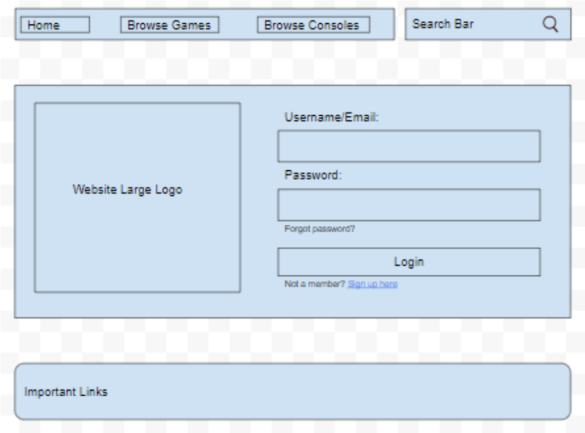

<h1>BitWikk Milestone 1</h1>

<h2>Division of Labor</h2>
Donald Hurld, DonaldHurldUni - login page wireframe and Bootstrap 
Einar Klarlund, einarklarlund - search page wireframe and Bootstrap 
Brian Zhang, BrianZhang42 - article page wireframe and Bootstrap 
Neil Gupta, nog642 - home page wireframe and Bootstrap 

<h3>Innovative Idea</h3>
Our team's web application will be a wiki made to document and share information about retro games. While separate wikis exist for specific games, at the moment there are no major websites that properly document details surrounding older games and their history. 

We plan on scraping various archives and websites to generate content for our web pages. There are many retro game archives that host scans of magazines, box covers, instruction manuals, etc. This would just be to populate our wiki initially, and users would be able to edit the content afterwards.

<h3>Home Page</h3>

 
Contains links to common functions for readers and contributors. It also has a collection of popular articles, with images to go along with them. The navigation bar, which is featured on every page, has links related to browsing by larger topics.

<h3>Article Page</h3>

 
Page design for article entries containing a search button to look for other articles, home button leading to the home page,
browse games button leading to a list of games, and a browse consoles button leading to a list of consoles. The page also contains the main article title, a description of the entry, a primary image, and brief significant details of the article. Along with that, the page has a related topics section as well as a gallery. Finally at the bottom, there is a comment section along with a footer with important links.

<h3>Search Result Page</h3>

 
The search results page features the pictures of each article very prominently, since we plan on having at least one image associated with each article. The images are organized in a grid below some large text displaying the search query.

<h3>Login Page</h3>

 
The login page allows the user to sign in or sign up.

Article Page Wireframe

