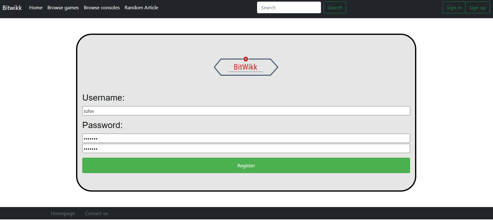
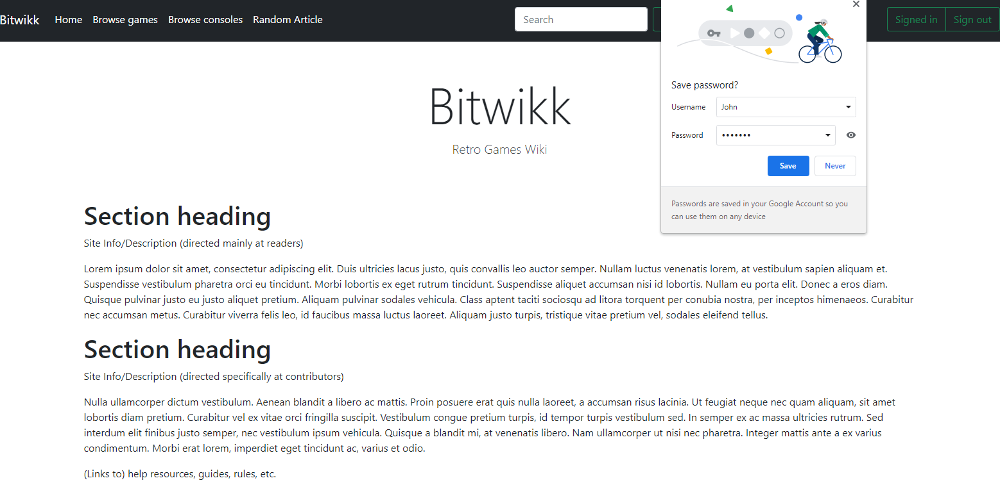
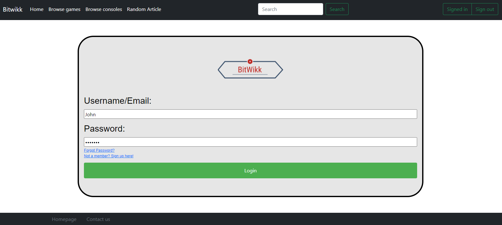

<h1>BitWikk Milestone 2</h1>

<h2>Division of Labor</h2>
Donald Hurld, DonaldHurldUni - server.js and routing functions 
Einar Klarlund, einarklarlund - JavaScript functions, article page functionality, models 
Brian Zhang, BrianZhang42 - Markdown files, Client/CRUD utility functions, HTML/CSS pages 
Neil Gupta, nog642 - Various routes and data processing, session management, Heroku deployment 

Objects:
User - {username, password (hash and salt)}
Article - ID (based on title), title, content, contributers, images (for gallery), commentIDs, category}
Comment - {ID, username, articleID, content}

### API:o

`GET  /article/{ID}`

This serves the static `article_page.html`, which then dynamically calls `GET /article/{ID}/get` and renders the content.

`GET  /article/{ID}/get`

This returns a JSON with article content

`POST /create`

Requires login (cookie header). Body: `{title: title, content: content}`

This request will be used to create new articles.

`POST /article/{ID}/edit`

Requires login (cookie header). Body: `{content: content}`

This request will be used to edit articles.

`POST /article/{ID}/comment`

Requires login (cookie header). Body: `{content: content}`

This request will be used to post a comment under an article.

`GET  /search?query={query}`

This will be used for the searchbar. It returns a list of articles as a JSON.

`GET  /category/{category}`

This will be used to browse by category. For now it returns a list of articles as a JSON.

`POST /user/login`

Body: `{username: username, password: password (plaintext)}`

This will be used to log in.

`POST /user/logout`
`        Requires login (cookie header)`

This will be used to log out (make the server forget the session).

`GET  /user/get?user={username}`

This will be used to get the user profile as a JSON. Currently there is no useful data there since the only thing there is the username.

`POST /user/create`

Body: `{username: username, password: password (plaintext)}`

This will be used to sign up for an account

`POST /user/edit`

Requires login (cookie header). Body: `{username: username, ...additional fields}`

This will be used to let a user edit their account (modify their profile in the future, or change their password).

`POST /user/delete?user={username}`

Requires login (cookie header).

This will be used to delete an account.

<h3>Register Page</h3>

 
Demonstrates the Create Operation by allowing a user to create an account in which the user inputs a username and
password that is stored.

<h3>Login Page</h3>

 
Demonstrates the Read Operation by finding a user that has registered and allowing them to login to their account
in which the sign in/sign up buttons become signed in/sign out.

<h3>Edit Page</h3>

 
Demonstrates the Update Operation by allowing the user to edit an article page and update any information they see fit.

<h3>Delete User</h3>

 
Demonstrates the Delete Operation by allowing the user to delete their own profile after they register and are logged in.
