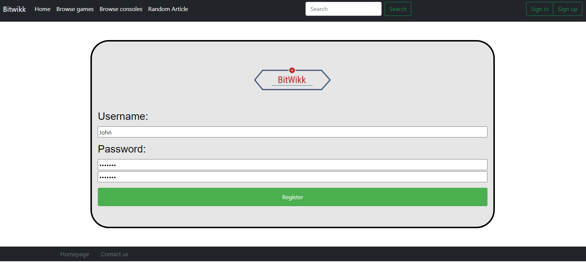
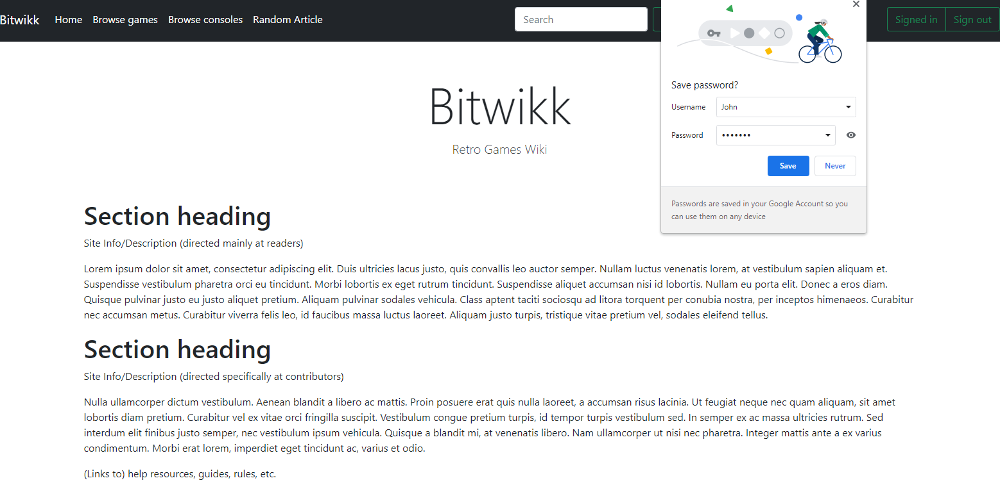
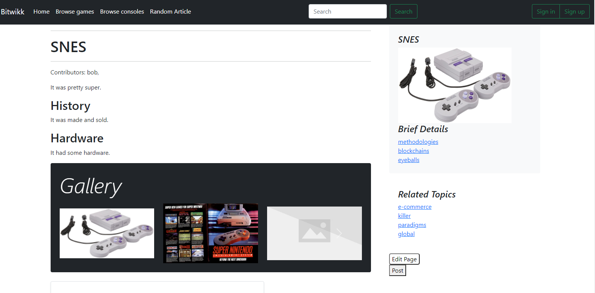
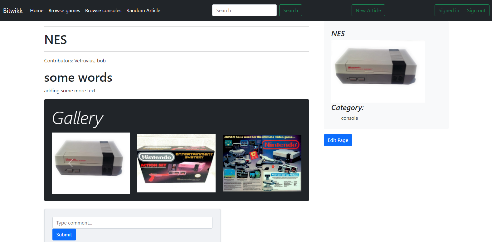
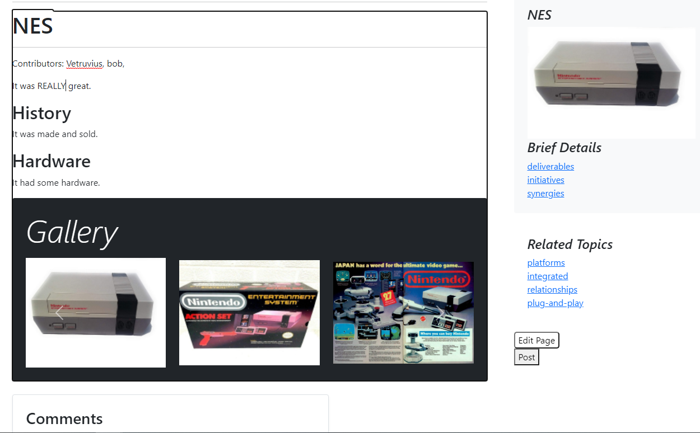

# BitWikk Milestone 2

## Division of Labor

Donald Hurld, DonaldHurldUni - server.js and routing functions

Einar Klarlund, einarklarlund - JavaScript functions, article page functionality, models

Brian Zhang, BrianZhang42 - Markdown files, Client/CRUD utility functions, HTML/CSS pages

Neil Gupta, nog642 - Various routes and data processing, session management, Heroku deployment

## Objects:

User - {username, password (hash and salt)}

Article - {ID (based on title), title, content, contributers, images (for gallery), commentIDs, category}

Comment - {ID, username, articleID, content}

Session - {sessionID, username, expiry}

## API:

`GET  /article/{ID}` 
This serves the static `article_page.html`, which then dynamically calls `GET /article/{ID}/get` and renders the content.

`GET  /article/{ID}/get` 
This returns a JSON with article content

`POST /create` 
Requires login (cookie header). Body: `{title: title, content: content}` 
This request will be used to create new articles.

`POST /article/{ID}/edit` 
Requires login (cookie header). Body: `{content: content}` 
This request will be used to edit articles.

`POST /article/{ID}/comment` 
Requires login (cookie header). Body: `{content: content}` 
This request will be used to post a comment under an article.

`GET  /search?query={query}` 
This will be used for the searchbar. It returns a list of articles as a JSON.

`GET  /category/{category}` 
This will be used to browse by category. For now it returns a list of articles as a JSON.

`POST /user/login` 
Body: `{username: username, password: password (plaintext)}` 
This will be used to log in.

`POST /user/logout` 
Requires login (cookie header). 
This will be used to log out (make the server forget the session).

`GET  /user/get?user={username}` 
This will be used to get the user profile as a JSON. Currently there is no useful data there since the only thing there is the username.

`POST /user/create` 
Body: `{username: username, password: password (plaintext)}` 
This will be used to sign up for an account

`POST /user/edit` 
Requires login (cookie header). Body: `{username: username, ...additional fields}` 
This will be used to let a user edit their account (modify their profile in the future, or change their password).

`POST /user/delete?user={username}` 
Requires login (cookie header). 
This will be used to delete an account.

## Screenshots

### Register Page

 
Demonstrates the Create Operation by allowing a user to create an account in which the user inputs a username and
password that is stored.

### Article Page

 
Demonstrates the Read Operation, because the client side JS gets the article content as a JSON from the server using a GET request, then renders it on the page.

### Article Edit Page

 
Demonstrates the Update Operation by allowing the user to edit an article page and update any information they see fit.

### Sign out

 
Demonstrates the Delete Operation by allowing the user to sign out, making the server delete the session.

Above, we first see what the user sees when they are signed in: the "Signed in" message, letting them know they are signed in, and the "Sign out" button. Next, we see what the user sees after clicking the "Sign out" button: a button to "Sign in" and a button to "Sign up".

Clicking the "Sign out" button sends a POST request to the server, deleting the session, and the server response's `Set-Cookie` header deletes the cookies on the client side. The client side JS then reloads the page.

## Heroku Application
[https://cs326-s22-41-bitwikk.herokuapp.com/](https://cs326-s22-41-bitwikk.herokuapp.com/)
