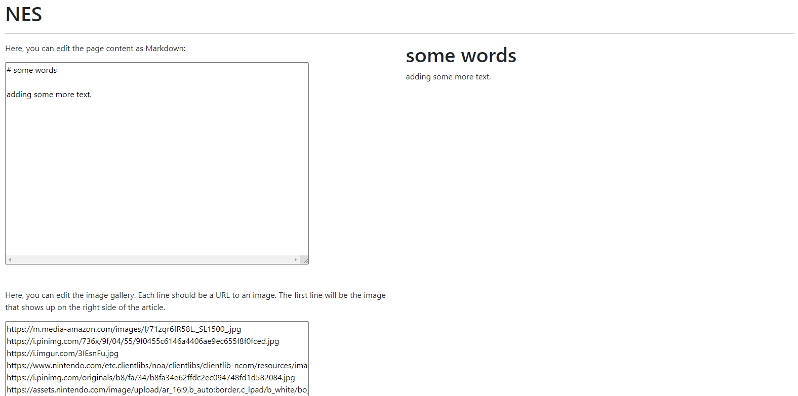

<h1>BitWikk Milestone 2</h1>

<h2>Division of Labor</h2>
Donald Hurld, DonaldHurldUni - server.js and routing functions 
Einar Klarlund, einarklarlund - JavaScript functions, article page functionality, models 
Brian Zhang, BrianZhang42 - Markdown files, Client/CRUD utility functions, HTML/CSS pages 
Neil Gupta, nog642 - Login/registration, random articles, Heroku 

Objects:
User - {username, password (hash and salt)}
Article - ID (based on title), title, content, contributers, images (for gallery), commentIDs, category}
Comment - {ID, username, articleID, content}

API:

GET  /article/{ID} serves the static article_page.html

GET  /article/{ID}/get returns a JSON with article content
POST /create 
        Requires login (cookie header) 
        Body: {title: title, content: content} 
UPDATE /article/{ID}/edit 
        Requires login (cookie header) 
        Body: {content: content} 
POST /article/{ID}/comment 
        Requires login (cookie header) 
        Body: {content: content} 

GET  /search?query={query}
GET  /category/{category}

POST /user/login 
        Body: {username: username, password: password (plaintext)} 
POST /user/logout 
        Requires login (cookie header) 
GET  /user/get?user={username} 
POST /user/create 
        Body: {username: username, password: password (plaintext)} 
UPDATE /user/edit 
        Requires login (cookie header) 
        Body: {username: username, ...additional fields} 
DELETE /user/delete?user={username} 
        Requires login (cookie header) 

<h3>Register Page</h3>

 
Demonstrates the Create Operation by allowing a user to create an account in which the user inputs a username and
password that is stored.

<h3>Login Page</h3>

 
Demonstrates the Read Operation by finding a user that has registered and allowing them to login to their account 
in which the sign in/sign up buttons become signed in/sign out.

<h3>Edit Page</h3>

 
Demonstrates the Update Operation by allowing the user to edit an article page and update any information they see fit.

<h3>Delete User</h3>

 
Demonstrates the Delete Operation by allowing the user to delete their own profile after they register and are logged in.